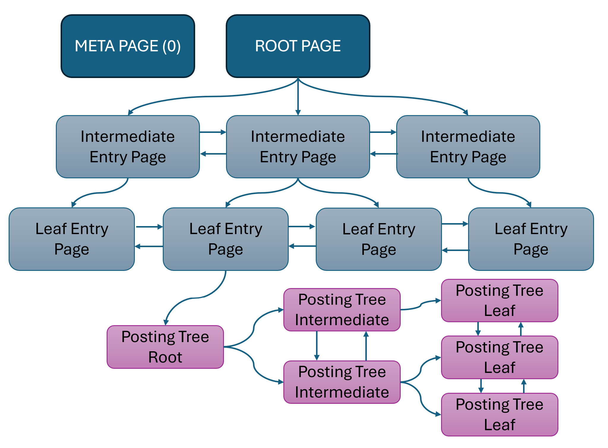

# DocumentDB Extended RUM - RUM access method

## Introduction

The documentdb_extended_rum (or extended_rum for short) access method derives its storage from the RUM index access method which originally derives from Postgres's GIN access method.
GIN and RUM were optimized for full text search type scenarios and were then extended to handle JSONB based schema-free inverted index queries as well. 
As this was extended towards the documentdb's BSON types, modifications were made to support more schema free scenarios.

Note that the folloiwng invariants are true:
1) From a storage standpoint, its content on disk is backwards compatible with that of RUM (it is fully back-wards compatible)
2) All changes must be made only on the query path and operator class extensibility path or in a way that works for indexes that are built with the default RUM repo.
3) Storage changes were made such that RUM itself could continue functioning on the same stored index

## License

This module is available under the [license](LICENSE) similar to
[PostgreSQL](http://www.postgresql.org/about/licence/).

## Index Structure

The extended_rum index layout consists of 3 types of PostgreSQL pages:
1) The META page - Stored at Block 0 and contains metadata about the index
2) ENTRY Pages - These store the core index entries that are used for lookups and are laid out as a BTree. The root page for this tree is stored at Block 1.
3) DATA Pages - These are posting trees storing bitmaps of rows matching a given entry The root of each posting tree is committed in the Entry that roots the tree.

### The Entry Tree

The entry tree is the primary B-Tree like data structure that is used for queries. The tree is rooted at the ROOT block (Block 1) and extends outwards with the standard Btree
structure that is similar to GIN. 
Each index entry key structure (by default) in a extended_rum index looks similar to a GIN index tuple:
The index starts out with a single ROOT block containing a LEAF Entry page. Each entry inserted into the tree is encoded with an IndexTuple that
contains the serialized index tuple. The index tuple's TID is used to encode row information about the index key. Each key starts out as a Posting List. This is encoded with the
TID containing a `numPostings > 0` into the Offset Number. The IndexTuple is then followed by a variable length PostingList for the index tuple. If the `numPostings` exceeds 65534
or if the indexKey and postings do not fit within a page, then the index key is converted to a Posting Tree. The CTID's offsetNumber is marked as `0xffff`, the BlockId of the CTID then
points to the root block number of the posting tree that will contain the set of rows matching this key.

For the Posting list & tree itself, the primary difference between GIN and the extended_rum index is that each posting is not just a TID - but also optionally encodes an `addInfo` which is
an additional metadata datum that can be attached to each row. Therfore a posting item has a 7-bit encoded varbyte BlockId, followed by a 7-bit encoded offset
except for the last byte which is 6-bit encoded, and the 7th bit indicates whether the addInfo is null or not. If it's not null, then the posting is followed by a 1, 2, 4, or 8 byte Datum value
for the `AddInfo`. The usage of this is discussed further below and in the original RUM index [README](https://github.com/postgrespro/rum/blob/master/README.md).

The structure of the addInfo bits looks as follows: Note that the addinfo is only present when not null.

Note that unlike GIN, the entry tree has Left and Right Page pointers to ensure we can walk the index forward and backward. Additionally, to support ordered and index scans, we eliminate the pending list.
To see why this is needed see the comment [here](https://github.com/postgres/postgres/blob/master/src/backend/access/gin/ginget.c#L1956)

The entry tree for extended_rum also allocates 2 unused bytes in the entry page header for the Vacuum Cycle Id. This is a concept that is borrowed from Btree to do disk order vacuuming for indexes. For further
discussion, please see the section on Vacuuming. DocumentDB Rum entries also set the LP_DEAD flag on index scans unlike RUM index entries to efficiently skip index entries in subsequent scans. This is taken as a reference implementation choice from GiST and Btree. Note that unlike Btree and GIST, we do not opportunistically prune these on page splits unlike Btree. This is because extended_rum uses Generic XLog for the WAL apply, and to handle the replica server's conflict XID horizon scenarios would require breaking the replica's transaction on XLogRedo. Since Generic XLog offers no opportunity to do this, we skip this and defer to Vacuum. Being able to do this would require a custom Rmgr implementation which is deferred at this time.

Note that unlike Btree, extended_rum pages do not store the high key offset in the page. The Max offset of a given key is the highest key on that page - this will become important when dealing with scenarios like
suffix truncation (see below).

Note that index entries must fit within the 2 KB limit to fit within 1 Postgres block. multi-column entries at the physical layer are handled by creating N disjoint trees within the index. Each index key is then tagged as a tuple of (ColumnId, IndexKey).
Queries against the index must handle these composite entires when scanning the tree. The tree is then layed out as an ordered set of entries that are prefixed by the column id (all column 0 appear before column 1 etc). For discussions on Composite ordered index (btree style) see the discussion on Operator class extensibility below.

### The Posting Tree
When a given index entry gets too big for a Block or does not fit within a block (factoring in page splits) etc, as discussed above, the posting list is then converted to a posting tree, and a pointer to it is stored
in the original entry. The posting tree itself starts out similarly, as a single LEAF block containing just a posting list. As the set of entries grows, the leaf page can be split into interior and leaf children through
page splits similar to the entry tree. Once again, similar to Entry Trees, extended_rum Posting Tree pages differ from GIN posting tree pages by having left and right pointers supporting forward and reverse walks of the
posting tree. Each posting can still be an ItemPointer with an addinfo similar to that of a PostingList. The Posting Tree leaves store the max item per page in the first entry (similar to that of a btree). Consequently, each
leaf page has a "RumItem" buffer in the prefix pointing to the highest entry stored in that block.

The tail of a Posting Tree page also has a set of "item indexes" which store the Posting at the "Nth" offset of the page. This is used in updates and fast scans to skip chunks of a posting tree page if a search reveals that it 
must continue from the middle of a page. These are maintained during updates/inserts.

Posting Tree leaf pages have similar metadata to GIN posting tree pages, with the following modifications:
1) The Vacuum CycleId is added to the page to ensure that disk order bulk delete can be done on posting trees as well
2) Additional bits are added to handle Incomplete Page Splits (to prevent lost path errors): This is ported from GIN and was missing in the original RUM index
3) In the case where addinfo is guaranteed to be null by construction, the root posting tree blockid is stored in the AddInfo Datum of the left most column. This is safe since this Datum is not accessed unless the AddInfo itself is not null
4) Metadata bit flags are added to track LP_DEAD page hints where the entire posting tree page is dead (similar to LP_DEAD handling for PostingLists in btree). Note that this doesn't exist for GIN or RUM but is a concept added to docmentdb_rum based on the reference implementation in GiST and Btree.

## Operator class Extensibility

The extended_rum index offers 3 types of index behaviors and the operator class extensibility is extended to handle each of these scenarios:
1) Classic GIN style indexes - these can be the inverted index text index style indexes or jsonb operator classes that support equality, or simple range scans with TID based intersections.
2) Extended information text indexes - These are the type of indexes that the RUM index was intended to deal with with order_by based on the full text score or relevance baked into the index
3) Btree style inverted indexes - these support btree style indexes on json style data that can do btree style operations, as well as GIN style operations on the same data.

Each type of index offers a subset of operator class support functions to emulate the behavior of the index.

Note that the extended_rum index offers arbitrary numbers of operators that can be declared for the operator class, as well as ORDER BY operators that can be used against the op-class. The following table lists the set of support functions for the index:

| Name |   Description   | Required | Number | Scenario | Notes |
| ---------------| -------- | ---------| ------------| ------| --- |
| compare | compare two keys and return an integer less than zero, zero, or greater than zero, indicating whether the first key is less than, equal to, or greater than the second | Yes | 1 | All | Same as GIN/RUM |
| extractValue | 	extract 0 or more keys from a value to be indexed (can be arbitrarily many) | Yes | 2 | All | Same as GIN/RUM
| extractQuery | extract keys from a query condition | Yes | 3 | All | Same as GIN/RUM |
| consistent | determine whether value matches query condition (Boolean variant) (optional if support function 6 is present) | Yes | 4 | All | Same as GIN/RUM |
| comparePartial | compare partial key from query and key from index, and return an integer less than zero, zero, or greater than zero, indicating whether the scan should ignore this index entry, treat the entry as a match, or stop the index scan | No | 5 | All | Same as GIN/RUM |	
| config | Configure the index_am behavior - for addinfo, natural sorting behavior for metadata, sparse key behavior etc. | No | 6 | 2 & 3 | Used in RUM, Extended in extended_rum to handle sparse index storage, etc |
| preconsistent | Similar to the consistent function - if implemented, supports a fast intersection between a high cardinality & low cardinality term | No | 7 | All | Same as RUM |
| ordering | Defines ordering behavior for order by distance for text-like indexes, or addinfo style indexes. On Btree style indexes, used to project the order operator result from the index key in the type of the operator's return type | No | 8 | 2 & 3 | Used in RUM for distance ordering. Used in Btree for covered index queries as well as order scan queries | Used in RUM, extended in extended_rum for ordering of Btree style indexes |
| outer/inner ordering | Defines ordering behavior when an order by attach index is specified with an alternate ordering for text style indexes. For Btree style indexes, provides a way to project the index key for various internal operations needed within the index (e.g. suffix truncation, skip scans, etc where operator class cooperation is needed) | No | 9 | 2 & 3 | Present in RUM, extended in extended_rum to handle skip_scan queries |
| addinfo join | | No | 10 | 2 | |
| operator class config | Custom proc that allows operator class options to be configured | No | 11 | All | Same as GIN but with a different support number. Not supported in RUM |
| canPreconsistent | Preconsistent assumes that all operators in the operator class support fast scans. This allows opt-in for specific operators as needed | No | 12 | All | Net new in extended_rum for opt-in for fast scans |

The section on query scans describes how these operator class support functions are used in various paths.

## Index Builds & Inserts
The index build and insert process follows the GIN logic pretty closely - including the integration for parallel index build. The primary difference is that extended_rum uses Generic_Xlog for writing out WAL (which is also elided in the case of build) One important callout is that extended_rum adds an option in the `config` proc such that documents that don't generate any index keys can opt to not insert any terms into the index. This is different than GIN and RUM that insert an "EMPTY" entry in this case. This helps reduce storage overhead for sparse or wildcard style indexes.

Additionally, the logic from GIN around incomplete page splits was missed when RUM was ported, and extended_rum ports that logic over to the index to avoid "Lost path" errors during inserts.

## Scans
The extended_rum index supports 4 types of scans of the index:
1) Fast Scans: These are scans that try to get fast intersections of equality keys between high cardinality and low cardinality keys by skipping TID ranges of high cardinality keys during the intersection. These require preconsistent to be implemented in the op-class and only work on equality joins.
2) Regular Scans: These are the bread-and-butter type scans of the GIN index and are implemented pretty-close to the GIN implementation. Some of the performance improvements of skipping posting tree ranges are added which model past attempts to add these into GIN (which was based off of the Fast scan approach RUM added originally).
3) Full Scans: These are scans that end up scanning the entire GIN/RUM index - used primarily in JSONB/Text style scans that may need to scan non-empty entries or ordering entries on the index.
4) Ordered Scans: These are net-new and added in documentdb to support BTree style index scans against an inverted index.

Note that extended_rum supports both bitmap scans and index scans. Characteristics for each are called out below.

### Fast Scans
Fast Scans are typically used for equality joins of `A && B` where A and B are equality predicates and is optimized for the case where A has high cardinality and B has low cardinality. This only works on an opclass that has:
- compare
- extractValue
- extractQuery 
- consistent
- preconsistent
- (optional) canPreconsistent

Fast Scans start the scan by running extractQuery against the given keys. If none of them require range scans (partialMatch), then they're eligible for fast scans if canPreconsistent doesn't exist or canPreconsistent says it's available.
The query then traverses the entry tree to each entry's leaf entry. The query then sorts the entries by estimated number of postings (for posting trees this is calculated).

The query then walks the entries in order (from lowest cardinality to highest cardinality) and intersects TIDs, binary searching the posting trees for the next available TIDs as needed. Once a TID is found that matches all predicates, it is returned to the calling indexscan/bitmap scan. Note that in the case of fast scans, if the candidate TID is not found in the current page, the search will walk up to the parent page and 'search' the appropriate posting tree page - skipping irrelevant chunks of the posting tree in the process using the intermediate nodes.

### Regular Scans
Regular scans are the bread & butter of the standard GIN and RUM Text Search and Json style queries. This works using the following operator classes:
- compare
- extractValue
- extractQuery
- consistent
- comparePartial

TO DO.

## Vacuuming & Maintenance

TO DO.

### Bulk Delete
As a refresher, at a high level vacuum for GIN/RUM indexes work as follows:
- Vacuum walks to the left-most leaf child of the entry tree from the root. Entry leaves are then visited from left to right (in tree order).
- For each leaf, the postings for each entry are cleaned up. Note: The empty entries are not cleaned up from the tree. While walking the entries, the posting tree roots are collected in memory.
- Once the entry page is cleaned up, the posting trees on that page are visited. For each posting tree, it walks to th eleft most leaf and prunes postings from the posting tree.
- After the leaves of each posting tree is cleaned up, the root posting tree is locked exclusively, and the tree is walked again, and empty posting tree pages are pruned.

The downsides of this vacuum process (specifically around documentdb style indexes) are the following:
- The tree ordered walk for bulk delete meant that for large indexes and slower disks, where buffer reading latency may be non-trivial, the vacuum performance can degrade

## Deltas over the default RUM index

The following list cover the changes made over PostgresPro RUM's physical implementation. The grouping is done by file/intent. Files that were left identical (outside of style changes) are marked as N/A. Each bullet comes with the top level feature it was targetting between ordering, index only scans, incomplete splits, LP_DEAD support, Performance, Vacuum, Diagnostics, testing, extensions for operator classes, ordered scans, changes to improve performance of regular/fast scans, general refactoring, parallel index build, parallel index scans, sparse indexes, planner improvements.

- rumbtree.c
    -  `[INCOMPLETE SPLIT]` This file has deltas to support lost path errors/incomplete splits. This ported the changes that were already present in the GIN index. RUM was forked from GIN in Postgres 9.3. Over PG 9.4 to PG 15, there were many changes in the GIN index to support incomplete splits and lost path errors. rumInsertOld tracks the logic that was present in RUM. rumInsertNew ports the same logic from ginbtree.c for rumPlaceToPage, rumFinishOldSplit, and rumFinishSplit. The main delta is on the actual page contents which uses the RUM leaf page state. There was one additional refactor to remove some local fields to make them function parameters in RumBtreeStack which are not ported.
- rumdatapage.c
    - `[REFACTOR]` Calls to `RumPageGetOpaque(page)->maxoff` was replaced with a macro `RumDataPageMaxOff(page)` for clarity. Calls to `RumPostingItemGetBlockNumber` got renamed to `PostingItemGetBlockNumber`. Calls to `RumPageGetOpaque(page)->freespace` got replaced with a macro `RumDataPageReadFreeSpaceValue`. Calls to `RumItemPointerSetMin` got renamed to `ItemPointerSetMin`
    - `[TESTING]` There's a test GUC for `RumDataPageIntermediateSplitSize` which forces a page split if the number of entries exceeds this test GUC to be able to test page splits on data pages. Never on in prod.
    - `[LP_DEAD]` dataPlaceToPage/dataSplitPageLeaf/dataSplitPageInternal/rumInsertItemPointers: Adds support for `LP_DEAD` on data pages. On place to/split of a page, revive the page (set the page flags to not be dead).
    - `[VACUUM]` dataSplitPageLeaf/dataSplitPageInternal: If the disk order vacuum is enabled, then set the vacuum cycle id on the page header from the shared memory state on a page split (borrowed logic from btree vacuum).
    - `[PERFORMANCE]` updateItemIndexes: Improve performance of reading ItemPointers from a posting list. Use static state blocknoIncr that we use to recompute delta state. This is borrowing the idea from gin's logic to read ItemPointers from a posting list. This uses a test GUC `RumUseNewItemPtrDecoding`
    - `[INCOMPLETE SPLIT]` rumPrepareDataScan: Add support for filling RumBtreeStack for incomplete split. This is similar to the logic in GIN for incomplete split - but the WAL logic is ported to generic xlog.
- rumentrypage.c
    - `[PERFORMANCE]` rumReadTuple: Apply the faster reads of ItemPointers under `RumUseNewItemPtrDecoding`
    - `[VACUUM]`: entryIsMoveRight: skip half dead pages when traversing the tree. Similar to btree.
    - `[VACUUM]`: entrySplitPage: If the disk order vacuum is enabled, then set the vacuum cycle id on the page header from the shared memory state on a page split (borrowed logic from btree vacuum).
    - `[TESTING]`: Add some asserts for the itemId written into a page
    - `[INCOMPLETE SPLIT]` rumPrepareEntryScan: Add support for filling RumBtreeStack for incomplete split. This is similar to the logic in GIN for incomplete split.
- rumvalidate.c
    - `[OPCLASS]`: Add validation of the operator classes to support ordering functions and auxiliary support functions for ordered scans.
- rumsort.c
    - `[REFACTOR]`: Strip all the includes below pg15 for the tuplesort copy
    - `[REGULARSCAN][PERFORMANCE]`: Add support for minimal tuples in the tuplestore that has JUST the TID and no extra data for the collectMatchBitmap

- rumutil.c
    - `[REFACTOR]`: Move all the rum options and GUCs into rumconfigs.c.
    - `[PARALLEL BUILD]`: Register options in the indexamhandler for `amcanbuildparallel`. Also port `rumbuildphasename` from GIN's parallel build, and add stage names for Writing WAL a the end of the build.
    - `[VACUUM]`: port adding amusemaintenanceworkmem, amparallelvacuumoptions to match what was set in GIN (RUM was missing this).
    - `[OPCLASS]`: Add amoptsprocnum into the indexam handler to match what GIN does to support operator class options in Postgres.
    - `[PARALLELSCAN]`: Register entrypoints for amestimateparallelscan, ruminitparallelscan, rumparallelrescan in the index am
    - `[SPARSEINDEX]`: Add option for `skipGenerateEmptyEntries` to skip generating the `NULL` entry on datums that don't generate terms. Populate this from the rumConfig struct. in `rumExtractEntries`, honor that and don't generate a null term if requested.
    - `[FASTSCAN]`: Add a support function `RUM_CAN_PRE_CONSISTENT_PROC` that allows operator classes to declare whether they support fast scans on that operator or not (RUM default assumes that all non-compare partial operators can support fast scans, but some operators can have disjunctions in the entries). Populate the RumState with it.

- rum.h/pg_documentdb_rum.h
    - `[REFACTOR]` Introduce macros for `PGDLLEXPORT` since documentdb_rum defaults to internal visibility of exports
    - `[VACUUM]` Introduce `RumVacuumCycleId` which mirrors `BTCycleId`
    - `[REFACTOR]` in RumPageOpaqueData, rename `maxoff` to `dataPageMaxoff` and make it `entryPageUnused` to indicate that the field is not used on entry pages. Rename `freespace` to `dataPageFreespace` to indicate it's meant for data pages only.
    - `[VACUUM]`: Introduce RumVacuumCycleId to the page header after offset. This takes up a previously unused 2 bytes in the header due to MAXALIGN and so becomes backwards compatible.
    - `[REFACTOR]` Remove RUM_LIST, RUM_LIST_FULLROW flags since they are unused.
    - `[LP_DEAD]` Introduce RUM page flags RUM_PAGE_IS_DEAD_ROWS for data pages that are dead.
    - `[VACUUM]`: Introduce RUM page flags for a page that is pruned during vacuuming, but not deleted (Similar to `BT_HALF_DEAD`).
    - `[INCOMPLETE SPLIT]`: Introduce RUM page flag RUM_INCOMPLETE_SPLIT which is set during page split to indicate the page is improperly split (similar to GIN/Btree equivalent flags)
    - `[REFACTOR]` Introduce `RumStatsData` which is currently identical to `GinStatsData` but resolves some type collisions between GIN and RUM
    - `[REFACTOR]` Introduce Macros for accessing/setting all the page flags including the ones introduced above.
    - `[ORDERING]` Introduce `RUM_CAT_ORDER_ITEM` which is a RUM query key that is used for ordering: *TODO*: This looks unused - deprecate?
    - `[REFACTOR]` Copy macros for `GIN_SEARCH_MODE_*` so that we break the dependency on importing the GIN header files in RUM
    - `[ORDERING]` Introduce `RUM_SEARCH_MODE_ORDERED` and `RUM_SEARCH_MODE_ORDERED_REVERSE` so operator classes can request ordered scans.
    - `[SPARSEINDEX]` Add skipGenerateEmptyEntries to RumConfig allowing operator classes to skip generating NULL terms. Populate that in RumState as well. Note: This is net new (does not exist in GIN/RUM).
    - `[REGULARSCAN][PERFORMANCE]` Add isMatchMinimalTuple to RumState to annotate whether the regular scan is on the minimal match (not addinfo style scans)
    - `[ORDERING]` Add queryKeyOverride in RumState to support Skip Scans. Introduce `RumOrderedScan` for ordered walks of the index. Introduce `RumOrderByScanData` for metadata tracking for ordered scans on the RumState information. Update RumScanOpaque to contain metadata for ordered scans with recheck.
    - `[INDEXONLYSCAN]` Add metadata to support index only scans in RumScanOpaque to project out index tuples in RumScanOpaque.
    - `[LP_DEAD]` Add metadata to track LP_DEAD tuples in the RumScanOpaque.
    - `[ORDERING][PERFORMANCE]` Add support for doing simple index walks and base regular scans in `amgettuple` without the re-sort in amgettuple.
    - `[OPCLASS]` Add RUM_INDEX_CONFIG_PROC, and RUM_CAN_PRE_CONSISTENT_PROC to support operator class extensibility for options, and pre-consistent checks for fast scans to be more customizable.
    - `[PERFORMANCE]` port decode_varbyte_blocknumber, rumDataPageLeafReadItemPointerWithBlockNumberIncr, rumPopulateDataPage etc. mirroring some of the performance improvements in GIN reading TIDs in a posting list (but accounting for addinfo for RUM). This is under RumUseNewItemPtrDecoding
    - `[PARALLEL BUILD]` Port PROGRESS_RUM_PHASE_MERGE_* introducing the parallel build stages from Gin for PG18.

- ruminsert.c
    - `[PARALLEL BUILD]` Copy of gininsert.c's changes for parallel build. Note that the RumTuple mirrors that of GinTuple and the tuplesort logic is copied as-is. Consequently, we can't support parallel build if any add-info or attach columns are set in the RUM index- which falls back to serial build of the index (this is net new to disable parallel build behavior on invalid configurations.). We added updates for the progress reporting to include building WAL etc since the original stage had some period of non-reporting during that interval for large indexes. Everything post rumbuild_serial is copied from GIN. rumbuild_serial represents the older index build that existed in RUM.
    - `[PERFORMANCE]` in RumHeapTupleInsert allow for cancellation in between inserts of terms if ExtractEntries returns multiple entries.

- rumvacuum.c
    - `[DIAGNOSTICS]` Added RumVacuumStatistics which tracks data that happens when vacuuming that can be logged.
    - `[VACUUM][PERFORMANCE]` Update RumVacuumState to add disk order vacuum - the additional fields of the struct borrow from btvacuum state.
    - `[VACUUM][PERFORMANCE]` rewrite rumVacuumPostingTreeLeaves to rumVacuumPostingTreeLeavesNew. Similarly rewrite rumVacuumPostingTree to rumVacuumPostingTreeNew. This follows the logic and updates in ginvacuum.c to reduce lock contention in posting tree pruning. Instead of locking the entire posting tree while vacuuming it, it first walks to the left-most leaf of the posting tree and walks left-to-right to delete TIDs in the posting tree. It still locks the root posting tree when pruning empty pages (similar to GIN). rumScanToDelete is also updated to be a copy of ginScanToDelete. Note: This fix was made to GIN after RUM forked and was missing in RUM.
    - `[VACUUM][PERFORMANCE]` Allow skipping marking pages as deleted if we can't safely obtain locks on the left/right/parent. This ensures that we don't stall waiting for LWLocks for too long. The next vacuum can retry in pruning the empty page and freeing up space (net new).
    - `[VACUUM][CLEANUP]` Start pruning empty entries within a leaf page in RUM. Note that RUM and GIN do not prune the entry tree at all. the entry tree will forever grow until a reindex. This updates `rumCleanupEmptyEntries` called on each leaf entry page to prune entries that don't have TIDs associated with them. Note that similar to Btree, to preserve the lehman-yao property, we preserve (do not delete) the high key of a page (the right most key) even if it's empty. then implement `CheckAndPruneEmptyRumPage` which validates that a page (including its right most entry) is fully empty, and deletes the page from the parent intermediate node. This follows btree's page deletion logic. The right most child of the intermediate page is not deleted.
    - `[VACUUM][REFACTOR]` rumVacuumSingleEntryPage - refactor logic for vacuuming single leaf page.
    - `[VACUUM]` Introduce rumbulkdeleteNew which does disk order vacuum copying btree vacuuming. The core bulkdelete new copies all the logic that is from btvacuum - does the disk order walk with the backtracks etc. For data pages, there's a separate track to handle disk order walk for data pages. For entry pages the logic is identical to btree. the behavior *within* an entry page mirrors rumVacuumSingleEntryPage which has rumbulkdeleteold.
    - `[VACUUM]` in rumvacuumcleanup for page cleanup, ensure we track GlobalVisCheckRemovableXid before removing a page. This is done in GIN but not done in RUM.
    - `[DIAGNOSTICS]`: add pgstat_progress_update_param for vacuum progress.
    - `[VACUUM]` for disk order vacuum, do the rumScanToDelete logic for page pruning for data pages (if we're not doing inline disk walk for data pages and only for entry pages).
    - `[VACUUM]` Try doing posting tree deletes without locking the posting tree root for the entire traversal. Instead walk the leaves left to right, and if a page is empty, then lock the root, delete the chain, and then resume. This minimizes the period where a posting tree root needs to be locked. (this is net new and borrowed from the entry tree deletion in btree.)
    - `[VACUUM]` TODO Porting: Embed the posting tree root into the data pages so that we can prune the vacuum trees inline for disk order vacuuming.

- rumscan.c
    - `[PARALLEL SCAN]`: setup RumParallelScanState/RumParallelScanDescData as a struct for storing state about parallel scans (borrowed from btree).
    - `[PERFORMANCE][OOM]` Allocate initRumState in a dedicated memory context to free it up on endscan explicitly. This was important for OOMs around exclusion constraint checks.
    - `[ORDERING]` Allow order operators in beginscan if the operator class supports the ordering function
    - `[SPARSEINDEX]` Disallow `GIN_SEARCH_MODE_INCLUDE_EMPTY` scans if the opclass requested no empty entries being indexed.
    - `[ORDERING][INDEXONLYSCAN][SKIPSCAN]` If we need ordered walks, set the scan type before initializing the scan keys.
    - `[INDEXONLYSCAN]` Support xs_want_itup if the operator class supports projection from the index. In this case, set up the scan state to reflect projection of tuples.
    - `[PARALLEL SCAN]`: Implement `ruminitparallelscan`, `rumparallelrescan`, `rum_parallel_scan_start`, `rum_parallel_seize`, `rum_parallel_release` and `rum_parallel_scan_start_notify` which borrow from the btree equivalent functions with similar names
    - `[DIAGNOSTICS]` Add top level function that can explain the details of the scan of a documentdb_rum index for extended explain.

New files added to documentdb_rum
- rumconfigs.c: Configurations for the RUM index.
    - `[REFACTOR]` New file in extended_rum. Has all the GUCs and rum options that was previously in rumutil.c.
    - `[REFACTOR]`: Add GUCs for all the different new settings introduced.

- documentdb_rum_init.c
    - `[REFACTOR]` Moved `PG_Init` logic here from rumutil.c. Also becomes the place for shared_preload_libraries initialization to ensure that the shared memory needed for Vacuum is initialized here.
    - `[REFACTOR]` Moved logic to extract logic to check and update for multi-key status on an index that's reused across different layers. *TODO*: Move this to a better named file.

- rum_debug.c: Functions to debug the index
    - `[DIAGNOSTICS]` These have low-level debug functions that allow inspecting entry/data pages in the RUM index.

- rum_repair.c: Operator functions to repair RUM indexes
    - `[VACUUM]`: Traverses the index and walks to inspect entries that are empty and not pruned. Optionally, prunes and writes to the WAL the empty entries.
    - `[INCOMPLETE SPLIT]`: Traverses the index, walks the leaf pages and checks for an incomplete split - logs any pages that have incomplete splits. Optionally, sets the `INCOMPLETE_SPLIT` flag on the page and marks the page dirty so that the next insert on the tree would repair the incomplete split.
    - `[LP_DEAD]`: Revives all index entry and data pages by unsetting LP_DEAD on them. Marks the buffers as dirty in the process.

- rumbuild_tuplesort.c: 
    - `[PARALLEL BUILD]` Copy of code that sits in Postgres's gininsert tuplesort logic for parallel index build. Copied from GIN logic, across multiple PG versions with appropriate PG VERSION macros guarding each version. This is not supported for PG15.

- rumsharedmem_utils.c
    - `[VACUUM]`: Manages vacuum shared memory state for disk order vacuuming. This logic is copied from btree's vacuuming logic to determine the vacuum cycle id and cache it in shared memory state.
    - `[PARALLEL SCAN]` Manages per query shared memory state for parallel scans. Copied from btree handling of shared memory state on a per query basis on the leader.

- rumselfuncs.c
    - `[PLANNING]`: RUM uses gincostestimate for cost selectivity. That uses ginGetStats which interprets the meta page assuming it's GIN. However, RUM has a different metapage structure so this implements rumcostestimate that allows to get the stats correctly. This also will be used to extend selectivity to do btree style selectivity if the operator class requires rather than GIN intersection style selectivity.

These files are retained as-is from RUM:
- btree_rum.c: N/A
- disable_core_macros.h: N/A 
- rum_arr_utils.c: N/A
- rumbulk.c: N/A
- rumtsquery.c: N/A

These files exist in public RUM that don't yet in documentdb_rum
- rum_debug_funcs.c
    - `[DIAGNOSTICS]` Low level debug functions for public RUM - to be ported into documentdb_rum and merged.
- rumtidbitmap.c/h
    - `[BUGFIX|ADDINFO]` *TODO* This was a bugfix that went in some time in 2025 that needs to be ported into documentdb_rum as well to handle a case of incorrect query results with addinfo.

The following files from the public RUM repo were removed:
- tuplesort96.c, tuplesort10-14.c, qsort_tuple.c: extended_rum only supports PG15 and higher

There's pending refactoring present in `rum.c` in pg_documentdb that needs to be ported into the extended_rum index.

- rumbeginscan/endscan/rescan is overridden in rum.c so that the ordering status, multi-key index status, as well as being able to merge all query keys to generate index keys before calling the index is done. This is technically just supposed to be a single support function on the operator class, but this is a refactor that is pending.
- Explain changes for the operator class is in `rum.c`. In reality, this should move out to another file since it is more about the operator class and less about the indexam.

--------------------------------------------------------------------------

TODO Files:
- rumget.c

### Original Authors
See [README](https://github.com/postgrespro/rum/blob/master/README.md)
